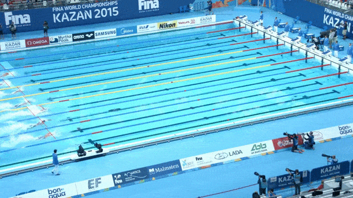
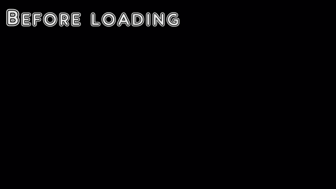
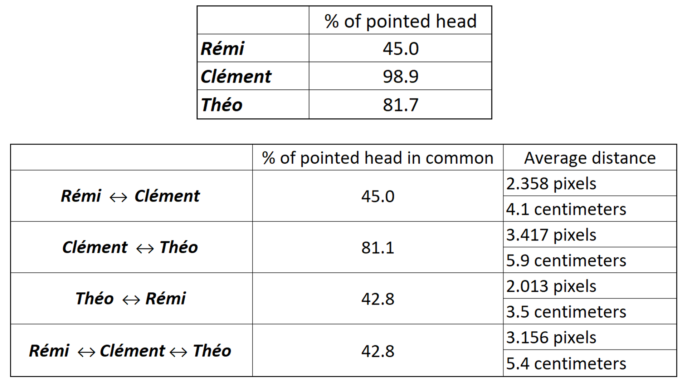
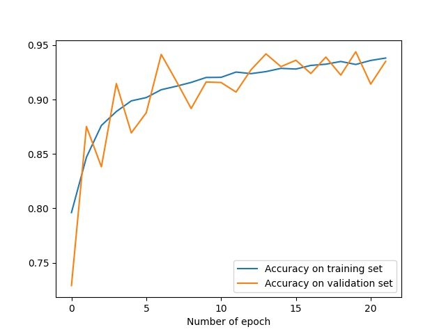
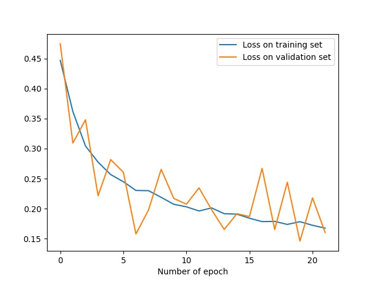
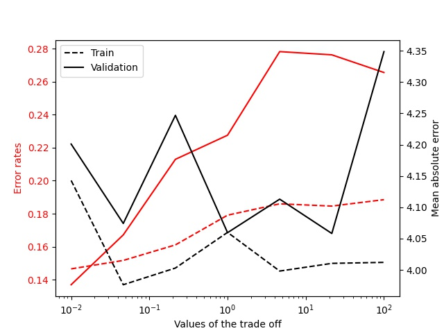
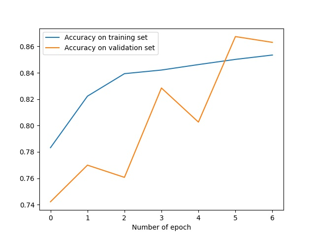
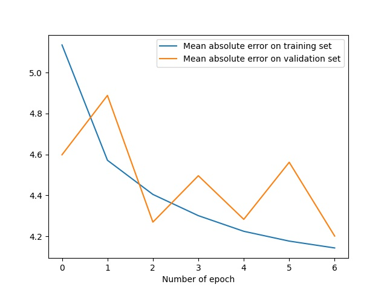
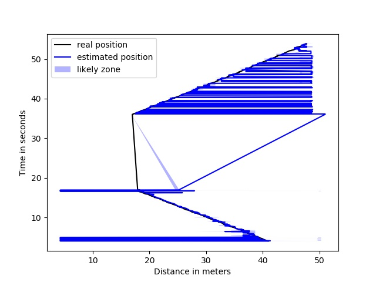
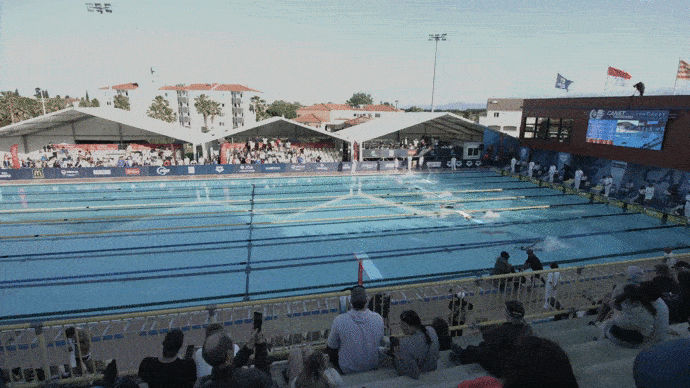

# SWIMMER TRACKING

### Presentation

This project aims to track the position of swimmers in a video clip. With the position of the swimmers, the instant velocity can be computed. We chose to track the head to deduce the position of the swimmer.
This project has been requested by the [French Swimming Federation](https://www.ffnatation.fr/) and financed by [ARN Neptune](https://anr.fr/).
The project has been made by [Théo Vincent](https://github.com/theovincent), [Maxime Brisinger](https://github.com/MaximeBrisinger), [Victoria Brami](https://github.com/Victoria-brami) and supervised by [Rémi Carmigniani](https://github.com/remingtonCarmi) and [Vincent Lepetit](http://imagine.enpc.fr/~lepetitv/).

The code contains two different methods of swimmer tracking : the first one focuses on the skin color of the swimmers and the second one uses neural networks. 
The inputs are videos filmed with a fixed camera.

Since there are any open source data set for our problem, we have create our own data set. It is available in this repository.

To enter more deeply in the code, please check the project_overview.pdf file.


### Results
- The first method uses computer vision techniques to catch the arms motion frequency of each swimmer.
<DIV ALIGN="CENTER">
<td></td>
</DIV>

- The second method uses a Deep Learning model. With a simple CNN architecture, we find the discrete position of each swimmer, at each time of the video. 

With a simple network, on the training set :
<DIV ALIGN="CENTER">
<td></td> <br>
</DIV>

With a deep network, on the training set : 
<DIV ALIGN="CENTER">
<td></td> <br>
</DIV>


### The data
Starting for a simple video clip, many operations are applied to the frames before passing through the neural network.
For example, it tooks 1 hour and 30 minutes to train the simple model on colab for small image with 150 pixels width.
<DIV ALIGN="CENTER">
<td></td> <br>
</DIV>

Before sampling the lanes, the sets look like the following gif.

The training set is composed of 9482 images from 5 different videos of 4 different races. Three races are inside, four of them are in HD and one of them is in 4K :
<DIV ALIGN="CENTER">
<td></td> <br>
</DIV>

The validation set is composed of 678 images from 1 4K outside video :
<DIV ALIGN="CENTER">
<td></td> <br>
</DIV>

There is not a unique answer to the problem since no one knows the exact position of the head of the swimmers.
Thus it is good to compare the pointed images between several humans. We have asked to 3 persons to point the head swimmers on 180 same images of the training set with varying difficulty.

<DIV ALIGN="CENTER">
<td></td> <br>
</DIV>


### Analysis of the results
The algorithm uses two neural networks : a rough one that is trained on 150 pixels width images and a tigh one that is trained on 30 pixels width images.

Here you may see the accuracy during the training of the simple model for 150 pixels width images.
<DIV ALIGN="CENTER">
<td></td> <br>
</DIV>

Here you may see the loss during the training of the simple model for 150 pixels width images.
<DIV ALIGN="CENTER">
<td></td> <br>
</DIV>

In this problem, we try to acheive two tasks : a classification (is the head in the sampled image ?) and a regression (in which column is the head in the sampled image ?).
This is why the loss is composed of two terms for the two task. A trade off has been added between those two terms. As the following graph shows, the best value of this trade off is 0.01.
<DIV ALIGN="CENTER">
<td></td> <br>
</DIV>

The second neural network has been trained with this value of trade off for 30 pixels width images.
<DIV ALIGN="CENTER">
<td></td> <br>
</DIV>
<DIV ALIGN="CENTER">
<td></td> <br>
</DIV>

With the predictions returned by the algorithm, a time according to the position of a particular swimmer can be computed.
This following graphic shows the position of the swimmer in the 7th lane for the validation set :
<DIV ALIGN="CENTER">
<td></td> <br>
</DIV>

Here, the prediction on the validation set can be seen :
<DIV ALIGN="CENTER">
<td></td> <br>
</DIV>

### Prerequisites & Installation

need Python version 3.7

To install all the required libraries run the command 
				

```bash
python requirements.py
```

In *"data\videos\"*, please put all the following videos :
- *vid0.mp4*
- *vid1.mp4*
- *100NL_FAF.mp4*
- *2004N_FHA.mp4*
- *100_NL_F_FA.mp4*
- *100_NL_D_FA-Canet.mp4*

These videos are provided by the [French Swimming Federation](https://www.ffnatation.fr/). Feel free to ask us how to download them.

**Note** : on Mac OS, some functionnalities might not work. Please tell us when you point some of them out. We'll fix them asap.

### Usage

**To test the first method based on the skin color**, run
```bash
python main_rough_detection.py
```
Before, feel free to modify the line 22 if you want the graph of more swimmers
```python
    # LANES we want to plot the swim frequency
LANES_TO_PLOT = [1]
```

**To test the second method based on the neural network**, run
```bash
python observe_model.py
```

**To label a video**, run
```bash
python create_data_set.py
```

## License
[ENPC](https://www.ecoledesponts.fr/)
